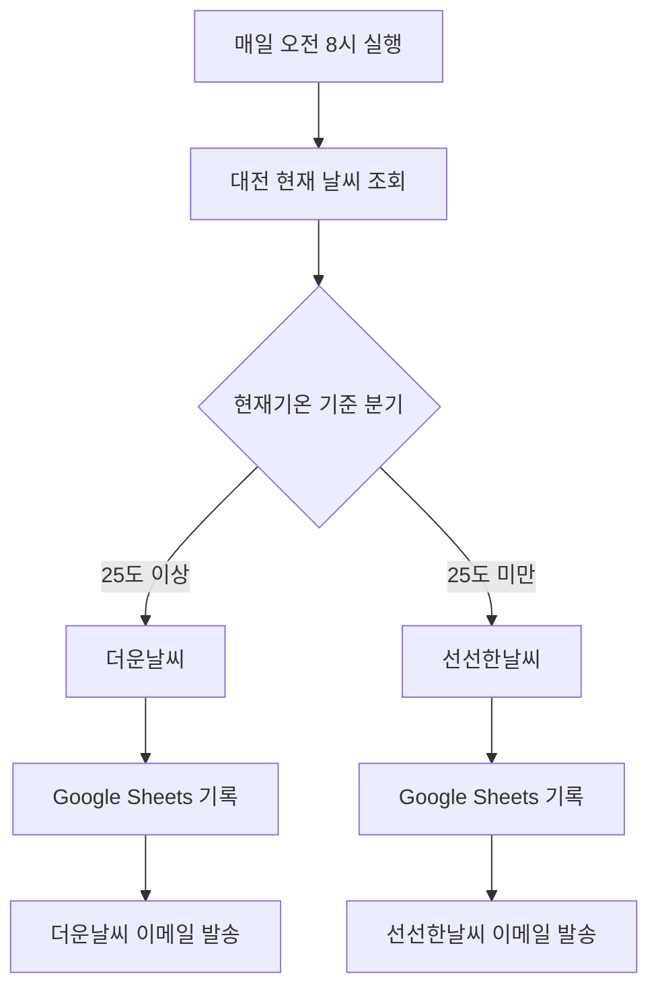
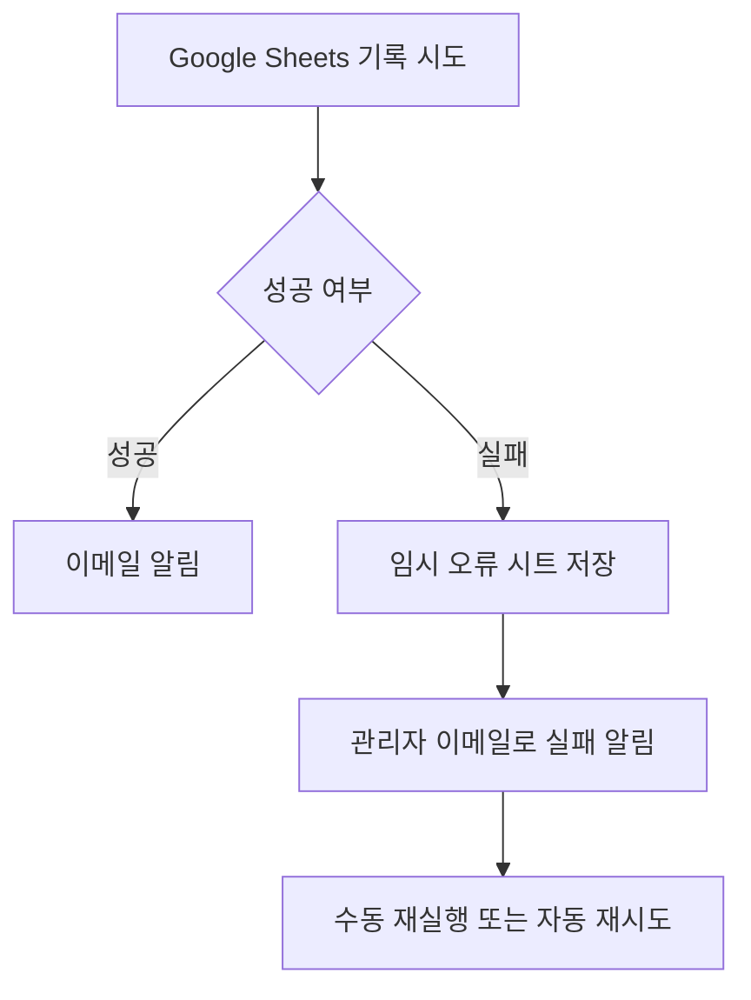
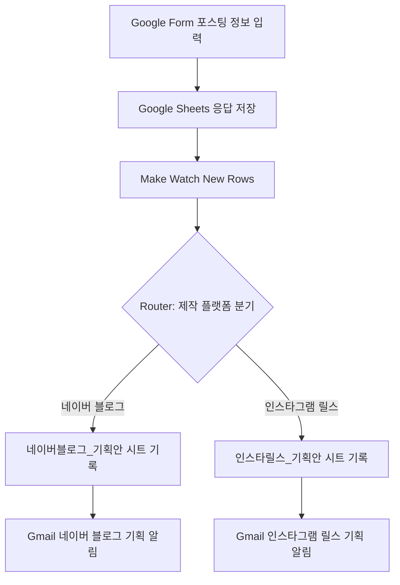

# 노코드 자동화 프로젝트 보고서  
## Make와 Zapier를 활용한 대전 날씨 알림 자동화 및 블로그·SNS 콘텐츠 아이디어 관리 자동화

- 작성자: 안영주
- 프로젝트 유형: 노코드 업무 자동화
- 사용 도구: Make, Zapier, Google Sheets, Gmail, Email by Zapier, Google Forms
- 제출 형식: Markdown
- 작성일: 2026년 7월

---

# 1. 프로젝트 개요

이번 프로젝트의 목표는 반복 업무를 자동화하는 과정을 직접 설계하고 구현하면서 **Trigger, Action, Filter, Router, Paths**의 개념을 이해하는 것이다.

프로젝트 1에서는 동일한 날씨 알림 업무를 Make와 Zapier에서 각각 구현하였다.  
프로젝트 2에서는 나의 실제 업무인 블로그·SNS 콘텐츠 기획을 더 효율적으로 관리하기 위해 **콘텐츠 아이디어 자동 수집 및 분류 시스템**을 설계하였다.

이번 과제를 통해 단순히 자동화 도구의 버튼을 연결하는 수준을 넘어 다음 내용을 학습했다.

1. 어떤 사건이 자동화를 시작시키는지 정의하는 방법
2. 조건에 따라 업무 흐름을 나누는 방법
3. 외부 서비스의 데이터를 다른 서비스로 전달하는 방법
4. 서로 다른 자동화 도구의 장단점을 비교하는 방법
5. 실제 생활과 업무에 자동화를 적용하는 방법

---

# 2. 핵심 개념 정리

## 2.1 Trigger

Trigger는 자동화를 시작시키는 사건이다.

이번 날씨 자동화에서 Trigger는 다음과 같다.

> 매일 오전 8시가 되면 자동화를 시작한다.

Make에서는 일정 실행 기능을 사용했고, Zapier에서는 `Schedule by Zapier`를 사용하였다.

## 2.2 Action

Action은 Trigger가 발생한 뒤 실제로 수행되는 작업이다.

이번 프로젝트의 주요 Action은 다음과 같다.

- 대전의 현재 날씨 조회
- Google Sheets에 날씨 데이터 기록
- Gmail 또는 Email by Zapier로 날씨 안내 발송

## 2.3 Filter와 Router/Paths

Filter는 특정 조건을 만족할 때만 다음 단계로 진행하도록 제한하는 기능이다.

Router와 Paths는 하나의 흐름을 여러 갈래로 나누는 기능이다.

이번 프로젝트에서는 현재기온을 기준으로 다음과 같이 분기하였다.

- 현재기온이 25도 이상이면 `더운날씨`
- 현재기온이 25도 미만이면 `선선한날씨`

---

# 3. 프로젝트 1 — 동일 자동화 워크플로우 비교 구현

## 3.1 자동화 주제

### 대전 날씨 자동 기록 및 이메일 알림

매일 오전 8시에 대전의 현재 날씨를 확인한 뒤, 현재기온에 따라 더운날씨와 선선한날씨로 분류한다. 결과는 Google Sheets에 기록하고 이메일로 안내한다.

## 3.2 공통 워크플로우



## 3.3 사용 데이터

- 지역: 대전
- 위도: 36.3504
- 경도: 127.3845
- 온도 단위: 섭씨
- 분류 기준: 25도

Google Sheets 열 구조는 다음과 같이 구성하였다.

| 실행일시 | 도시 | 현재기온 | 체감기온 | 날씨상태 | 습도 | 풍속 | 분류결과 | 알림내용 |
|---|---|---:|---:|---|---:|---:|---|---|

---

# 4. Make 구현

## 4.1 사용 모듈

1. Weather — Get current weather
2. Router
3. Google Sheets — Add a Row
4. Gmail — Send an Email
5. Schedule — 매일 오전 8시

## 4.2 구현 과정

### 1단계: Weather 모듈 설정

대전의 현재 날씨를 조회하도록 Weather 모듈을 설정하였다.

조회 결과 예시:

- 현재기온: 약 28~31도
- 습도: 약 56~70%
- 풍속: 약 1~5
- 날씨상태: 구름

### 2단계: Router 추가

Weather 뒤에 Router를 추가하여 두 개의 경로를 만들었다.

#### 경로 1 — 더운날씨

```text
현재기온 ≥ 25
```

#### 경로 2 — 선선한날씨

```text
현재기온 < 25
```

### 3단계: Google Sheets 연결

각 경로에 Google Sheets의 `Add a Row` 모듈을 연결하였다.

더운날씨 경로는 `더운날씨` 시트에 기록하고, 선선한날씨 경로는 `선선한날씨` 시트에 기록하도록 설정하였다.

### 4단계: Gmail 연결

Google Sheets 다음 단계에 Gmail을 연결하였다.

더운날씨 이메일 예시:

```text
[대전 날씨 알림] 현재기온은 29.69도입니다.

오늘은 25도 이상으로 더운 날씨입니다.
물을 충분히 마시고 외출할 때 모자나 양산을 준비하세요.
```

선선한날씨 이메일 예시:

```text
[대전 날씨 알림] 현재기온은 24도입니다.

오늘은 25도 미만으로 선선한 날씨입니다.
얇은 겉옷을 준비하세요.
```

### 5단계: 자동 실행 설정

Make 시나리오가 매일 오전 8시에 실행되도록 설정하였다.

## 4.3 Make 실행 결과

현재기온이 25도 이상일 때 더운날씨 경로가 실행되었고 다음 결과를 확인하였다.

- Weather 조회 성공
- Router의 더운날씨 경로 통과
- Google Sheets에 새 행 기록
- Gmail 발송 성공

선선한날씨 경로는 실제 기온이 25도 이상이어서 자연 실행이 어려웠다. 따라서 테스트 단계에서 기준을 임시로 높여 두 번째 경로가 실제로 실행되는지 확인한 뒤 운영 기준을 다시 25도로 복원하였다.

## 4.4 Make 캡처 삽입 위치

> 아래 파일명으로 캡처를 저장한 뒤 GitHub 저장소의 `images` 폴더에 넣는다.

```markdown


```

---

# 5. Zapier 구현

## 5.1 사용 기능

1. Schedule by Zapier — Every Day
2. Weather by Zapier — 현재 날씨 조회
3. Paths by Zapier
4. Google Sheets — Create Spreadsheet Row
5. Email by Zapier — Send Outbound Email

## 5.2 구현 과정

### 1단계: Schedule Trigger

Zapier에서 매일 오전 8시에 실행되도록 설정하였다.

### 2단계: Weather by Zapier

대전의 위치를 위도와 경도로 입력하였다.

```text
위도: 36.3504
경도: 127.3845
단위: 섭씨
```

### 3단계: Paths 설정

두 개의 경로를 만들었다.

#### 경로 A — 더운날씨_25도이상

```text
온도 ≥ 25
```

#### 경로 B — 선선한날씨_25도미만

```text
온도 < 25
```

### 4단계: Google Sheets 기록

각 경로에서 Google Sheets의 `Create Spreadsheet Row`를 사용하였다.

Make와 같은 Google Sheets 파일을 사용하되 분류결과에 도구 이름을 함께 기록하여 구분하였다.

예시:

```text
더운날씨_Zapier
선선한날씨_Zapier
```

### 5단계: Email by Zapier

Zapier의 Gmail 연결에서는 새 이메일 발송 항목이 보이지 않아 `Email by Zapier`의 `Send Outbound Email`을 사용하였다.

더운날씨 이메일 제목:

```text
[Zapier 대전 날씨] 더운날씨 알림
```

더운날씨 본문:

```text
안녕하세요.

오늘 대전의 현재기온은 31.19도입니다.

25도 이상으로 더운 날씨입니다.
물을 충분히 마시고 외출할 때 모자나 양산을 준비하세요.

이 메일은 Zapier 자동화에서 발송되었습니다.
```

## 5.3 Zapier 실행 결과

실제 대전 기온이 31.19도로 조회되었고, 더운날씨 조건을 충족하였다.

```text
31.19 ≥ 25 → 참
```

그 결과 다음 작업이 실행되었다.

- Google Sheets에 새로운 행 생성
- 분류결과에 `더운날씨_Zapier` 기록
- Email by Zapier를 통해 더운날씨 이메일 수신

선선한날씨 이메일은 액션 단독 테스트 또는 임시 조건 조정을 통해 발송 기능을 확인하였다. 테스트 후 조건은 다시 `온도 < 25`로 복원하였다.

## 5.4 Zapier 캡처 삽입 위치

```markdown


```

---

# 6. Make와 Zapier 비교 분석

| 비교 항목 | Make | Zapier |
|---|---|---|
| 화면 구조 | 원형 모듈을 선으로 연결하는 시각적 구조 | 위에서 아래로 이어지는 단계형 구조 |
| 조건 분기 | Router와 Filter로 여러 경로를 한눈에 확인 가능 | Paths를 사용하며 경로별 카드로 구성 |
| 초보자 접근성 | 처음에는 용어와 매핑이 다소 어렵지만 전체 흐름이 잘 보임 | 기본 단계는 직관적이나 Paths와 데이터 매핑이 복잡하게 느껴짐 |
| 데이터 매핑 | 이전 모듈의 값을 색상 토큰으로 선택 | `+` 버튼을 눌러 이전 단계 데이터를 선택 |
| 실행 로그 | 모듈별 처리 건수와 입출력 데이터를 자세히 확인 가능 | 단계별 테스트 결과와 실행 기록을 확인 가능 |
| Google Sheets 연결 | Add a Row 설정이 시각적으로 명확함 | Create Spreadsheet Row 설정은 가능하지만 번역 화면에서 필드 선택이 다소 혼란스러움 |
| 이메일 발송 | Gmail 모듈을 직접 연결 | Gmail에서 새 메일 발송 항목이 보이지 않아 Email by Zapier로 대체 |
| 분기 테스트 | 기준값을 임시 변경하여 각 경로 테스트가 쉬움 | Paths의 개별 Action 테스트와 전체 경로 테스트를 구분해야 함 |
| 한글 번역 | 일부 메뉴가 어색하게 번역됨 | 일부 기능명이 매우 어색하게 번역되어 메뉴 탐색이 어려움 |
| 적합한 상황 | 복잡한 다중 분기, 데이터 흐름 시각화, 세밀한 자동화 | 단순하고 빠른 단계형 자동화, 다양한 앱 연결 |

## 6.1 Make의 장점

- 전체 자동화 구조를 한 화면에서 확인하기 쉽다.
- Router를 활용한 여러 조건 분기가 직관적이다.
- 실행 결과를 모듈별로 자세히 확인할 수 있다.
- 복잡한 자동화로 확장하기 좋다.

## 6.2 Make의 단점

- 초보자에게 필터와 데이터 매핑 방식이 어렵게 느껴질 수 있다.
- 한글 번역이 어색한 항목이 있다.
- 모듈 설정 항목이 많아 처음에는 시간이 걸린다.

## 6.3 Zapier의 장점

- Trigger와 Action을 위에서 아래로 순서대로 설정하기 쉽다.
- 앱 검색과 연결 과정이 비교적 빠르다.
- Email by Zapier 같은 자체 도구를 활용할 수 있다.

## 6.4 Zapier의 단점

- Paths와 데이터 매핑 단계가 초보자에게 복잡하게 느껴졌다.
- Gmail의 새 메일 발송 기능이 현재 화면에서 보이지 않아 다른 이메일 도구를 사용해야 했다.
- 액션 단독 테스트는 조건 분기를 우회할 수 있어 실제 경로 테스트와 구분해야 한다.
- 한글 자동 번역 때문에 메뉴 의미를 파악하기 어려운 경우가 많았다.

## 6.5 최종 평가

이번 프로젝트에서는 **Make가 더 이해하기 쉽고 나의 업무에 적합했다.**

그 이유는 다음과 같다.

1. Router의 두 경로가 화면에서 명확하게 보였다.
2. Weather, Google Sheets, Gmail의 흐름을 시각적으로 이해하기 쉬웠다.
3. 실행 결과를 각 모듈에서 바로 확인할 수 있었다.
4. 향후 블로그·SNS 콘텐츠를 여러 카테고리로 분류하는 자동화에 활용하기 좋았다.

Zapier는 간단한 자동화에는 빠르고 편리했지만, Paths와 필드 매핑 과정에서 더 많은 시행착오가 있었다.

---

# 7. 프로젝트 1 테스트 케이스

## 테스트 케이스 1 — 더운날씨 경로

| 항목 | 내용 |
|---|---|
| 입력값 | 대전 현재기온 31.19도 |
| 조건 | 현재기온 ≥ 25 |
| 예상 결과 | 더운날씨 경로 실행 |
| 실제 결과 | Google Sheets 기록 및 이메일 발송 성공 |
| 판정 | 성공 |

## 테스트 케이스 2 — 선선한날씨 경로

| 항목 | 내용 |
|---|---|
| 실제 기온 | 25도 이상 |
| 테스트 방식 | 기준 온도를 임시로 높이거나 Action 단독 테스트 실시 |
| 예상 결과 | 선선한날씨 경로의 시트 기록과 이메일 발송 기능 확인 |
| 실제 결과 | 시트 기록 및 이메일 발송 확인 |
| 후속 조치 | 운영 기준을 다시 25도로 복원 |
| 판정 | 성공 |

---

# 8. 프로젝트 1 보안 및 오류 대응

## 8.1 개인정보 보호

제출용 화면에서는 다음 정보를 가린다.

- Gmail 주소 일부
- Google 계정 프로필 정보
- 개인 이름
- 공유 링크의 민감한 식별값

표시 예시:

```text
a0119***@gmail.com
```

## 8.2 오류 대응

발생한 주요 오류와 해결 방법은 다음과 같다.

| 오류 | 원인 | 해결 |
|---|---|---|
| Make Google Sheets 드라이브 값 누락 | Drive 미선택 | My Drive 선택 |
| 두 경로 모두 실행되지 않음 | 필터 조건이 동일하거나 연산자 오류 | 숫자 연산자로 수정 |
| 시간 연산자 선택 | 온도값을 시간으로 비교 | 숫자 연산자로 변경 |
| Zapier 날씨 테스트 결과 지연 | 날씨 서비스 응답 또는 화면 표시 지연 | 재테스트 및 좌표 확인 |
| 시트에 설명 문구가 그대로 기록 | 실제 데이터 대신 텍스트 입력 | 이전 단계 데이터 토큰으로 재매핑 |
| 31도인데 선선한날씨 메일 발송 | Action 단독 테스트 또는 임시 조건 | 테스트와 실제 실행을 구분하고 조건 복원 |

## 8.3 실패 알림 및 재시도 전략

향후 다음 기능을 추가할 수 있다.



---

# 9. 프로젝트 2 — Make 기반 블로그·SNS 포스팅 자동 기획 및 분류 서비스

## 9.1 프로젝트 주제

### ‘오늘도 영주’ 블로그·SNS 포스팅 자동 기획 시스템

나는 대전생활, 아들셋맘, 야구맘, 맛집·리뷰, AI 활용 등의 주제로 블로그와 SNS 콘텐츠를 만들고 있다. 평소 포스팅 아이디어와 현장 경험을 여러 곳에 흩어 기록해 다시 찾거나 플랫폼별로 정리하는 일이 반복되었다.

이번 프로젝트에서는 다음 업무를 자동화하였다.

> Google Form에 포스팅 정보를 입력하면 Make가 새 응답을 감지하고, 제작 플랫폼에 따라 네이버 블로그와 인스타그램 릴스로 분류한 뒤 각각의 Google Sheets 기획안 탭에 저장하고 Gmail로 알림을 발송한다.

## 9.2 자동화할 반복 업무

기존 수동 업무는 다음과 같았다.

1. 콘텐츠 아이디어와 경험을 별도로 기록
2. 네이버 블로그용인지 인스타그램 릴스용인지 다시 분류
3. 주제, 장소, 핵심 경험, 장점, 아쉬운 점을 재정리
4. 우선순위를 별도로 판단
5. 정리 내용을 다시 이메일이나 문서로 옮김

이를 한 번의 폼 입력으로 처리하도록 설계하였다.

## 9.3 선정 도구와 이유

### 선정 도구: Make

Make를 선택한 이유는 다음과 같다.

1. 프로젝트 1에서 Google Sheets, Router, Filter, Gmail을 이미 사용하였다.
2. 원형 모듈과 연결선으로 전체 흐름을 한눈에 확인할 수 있었다.
3. Zapier의 Paths보다 Router와 Filter가 나의 업무 흐름을 이해하기 쉬웠다.
4. 실행 결과와 오류 위치를 모듈별로 확인할 수 있었다.
5. 향후 AI 제목 생성, 키워드 추천, 초안 작성 기능으로 확장하기 좋다.

## 9.4 전체 워크플로우



## 9.5 Google Form 구성

폼 제목:

```text
오늘도 영주 포스팅 자동 기획 신청서
```

질문 구성:

| 번호 | 질문 | 형식 | 필수 |
|---:|---|---|---|
| 1 | 포스팅 주제를 입력하세요 | 단답형 | 필수 |
| 2 | 콘텐츠 카테고리를 선택하세요 | 객관식 | 필수 |
| 3 | 제작할 플랫폼을 선택하세요 | 객관식 | 필수 |
| 4 | 장소명 또는 제품명을 입력하세요 | 단답형 | 선택 |
| 5 | 핵심 경험과 꼭 넣고 싶은 내용을 적어주세요 | 장문형 | 필수 |
| 6 | 장점을 적어주세요 | 장문형 | 선택 |
| 7 | 아쉬운 점을 적어주세요 | 장문형 | 선택 |
| 8 | 작성 우선순위를 선택하세요 | 객관식 | 필수 |

카테고리 선택지:

```text
대전생활
야구맘
아들셋맘
맛집·리뷰
AI·블로그
기타
```

플랫폼 선택지:

```text
네이버 블로그
인스타그램 릴스
유튜브 쇼츠
스레드
여러 플랫폼 공용
```

우선순위 선택지:

```text
오늘 작성
이번 주 작성
시간이 날 때
자료 수집 후 작성
```

## 9.6 Google Sheets 구성

Google Form 응답은 `설문지 응답 시트1`에 저장하였다.

| 타임스탬프 | 포스팅 주제 | 콘텐츠 카테고리 | 제작 플랫폼 | 장소·제품명 | 핵심 경험 | 장점 | 아쉬운 점 | 우선순위 |
|---|---|---|---|---|---|---|---|---|

플랫폼별 결과 탭:

```text
네이버블로그_기획안
인스타릴스_기획안
```

두 결과 탭의 열 구조:

| 등록일시 | 포스팅주제 | 카테고리 | 플랫폼 | 장소제품명 | 핵심경험 | 장점 | 아쉬운점 | 우선순위 |
|---|---|---|---|---|---|---|---|---|

## 9.7 Make 구현

### Trigger

```text
Google Sheets — Watch New Rows
```

주요 설정:

```text
Drive: 내 드라이브
Spreadsheet: 오늘도 영주 포스팅 자동화
Sheet: 설문지 응답 시트1
Header: Yes
Header range: A1:I1
```

### Router

Watch New Rows 뒤에 Router를 연결하여 제작 플랫폼을 기준으로 두 경로로 분기하였다.

## 9.8 경로 1 — 네이버 블로그

Filter:

```text
제작할 플랫폼을 선택하세요. (D)
포함
네이버 블로그
```

Action 1:

```text
Google Sheets — Add a Row
저장 탭: 네이버블로그_기획안
```

Action 2:

```text
Gmail — Send an Email
```

메일 제목:

```text
[포스팅 기획 완료] 네이버 블로그 - [포스팅 주제]
```

## 9.9 경로 2 — 인스타그램 릴스

Filter:

```text
제작할 플랫폼을 선택하세요. (D)
포함
인스타그램 릴스
```

Action 1:

```text
Google Sheets — Add a Row
저장 탭: 인스타릴스_기획안
```

Action 2:

```text
Gmail — Send an Email
```

메일 제목:

```text
[포스팅 기획 완료] 인스타그램 릴스 - [포스팅 주제]
```

## 9.10 열 매핑

| 결과 시트 열 | 원본 응답 데이터 |
|---|---|
| 등록일시 | 타임스탬프 |
| 포스팅주제 | 포스팅 주제 |
| 카테고리 | 콘텐츠 카테고리 |
| 플랫폼 | 제작 플랫폼 |
| 장소제품명 | 장소명 또는 제품명 |
| 핵심경험 | 핵심 경험 |
| 장점 | 장점 |
| 아쉬운점 | 아쉬운 점 |
| 우선순위 | 작성 우선순위 |

모든 값은 직접 문구를 입력하지 않고 Watch New Rows의 초록색 데이터 토큰으로 연결하였다.

## 9.11 실행 테스트

### 테스트 1 — 네이버 블로그

```text
Google Form 제출
→ 설문지 응답 시트 기록
→ 네이버 블로그 Filter 통과
→ 네이버블로그_기획안 기록
→ Gmail 발송
```

결과: 성공

### 테스트 2 — 인스타그램 릴스

```text
Google Form 제출
→ 설문지 응답 시트 기록
→ 인스타그램 릴스 Filter 통과
→ 인스타릴스_기획안 기록
→ Gmail 발송
```

결과: 성공

두 경로 모두 실제 결과 시트 저장과 이메일 수신까지 확인하였다.

## 9.12 구현 중 오류와 해결

| 오류 | 원인 | 해결 |
|---|---|---|
| Google Form 제출 버튼이 회색 | 게시되지 않은 설문지 | 링크가 있는 사용자에게 공개 후 게시 |
| Make에서 Drive 값 오류 | Drive 미선택 | 내 드라이브 선택 |
| 결과 시트에 기록되지 않음 | Filter 비교값이 비어 있음 | 네이버 블로그 또는 인스타그램 릴스 입력 |
| Router 두 경로가 0건 | D열 값과 Filter 비교문구 불일치 | 실제 입력값과 같은 문구로 수정 |
| 기존 응답이 처리되지 않음 | 새 행 감시 방식 | 한 번 실행 후 새 응답 제출 |
| Gmail 제목 없음 | 제목 필드 미입력 | 고정 문구와 포스팅 주제 토큰 연결 |
| Gmail 본문이 한 줄 | 원시 HTML 형식 | 본문 형식을 수집으로 변경하고 줄바꿈 적용 |

## 9.13 프로젝트 2 완료 상태

- [x] Google Form 제작
- [x] Google Sheets 응답 연결
- [x] Watch New Rows Trigger
- [x] Router 플랫폼 분기
- [x] 네이버 블로그 결과 시트 저장
- [x] 인스타그램 릴스 결과 시트 저장
- [x] 네이버 블로그 Gmail 발송
- [x] 인스타그램 릴스 Gmail 발송
- [x] 서로 다른 두 경로 실행 확인

## 9.14 프로젝트 2 캡처 삽입 위치

```markdown


```

---

# 10. 프로젝트를 통해 배운 점

이번 과제를 통해 자동화는 단순히 앱을 연결하는 일이 아니라, 반복 업무를 분석하고 Trigger, Action, Filter, Router의 역할을 정확히 설계하는 과정임을 알게 되었다.

프로젝트 1에서는 날씨 데이터를 기준으로 조건을 분기했고, 프로젝트 2에서는 실제 나의 콘텐츠 업무에 플랫폼 분기를 적용하였다.

특히 프로젝트 2에서 Filter의 비교값이 비어 있으면 Router가 어느 경로로도 데이터를 보내지 않는다는 점을 직접 경험했다. 실행 로그와 실제 D열 값을 비교하며 오류를 해결했고, 초록색 데이터 토큰으로 이전 단계 값을 정확히 전달하는 것이 중요하다는 점을 배웠다.

Make는 Zapier보다 전체 흐름이 시각적으로 잘 보였고, 실제 나의 블로그·SNS 업무에 확장하기 더 적합하다고 느꼈다.

---

# 11. 향후 확장 계획

## 11.1 네이버 블로그 기획 자동화

- 대표 검색어
- 보조 검색어
- 제목 후보 5개
- 첫 150자 핵심 답변
- 목차
- FAQ
- CTA
- 태그 5개

## 11.2 인스타그램 릴스 기획 자동화

- 첫 3초 훅
- 장면 구성
- 자막 문구
- 캡션
- CTA
- 해시태그

## 11.3 AI 연결

```text
Google Form 입력
→ Make 감지
→ 생성형 AI가 플랫폼별 기획안 생성
→ Google Sheets 저장
→ Gmail 전달
```

## 11.4 최종 검토 후 발행

플랫폼 정책과 계정 보안을 고려하여 자동 게시보다는 기획안 생성까지 자동화하고, 최종 발행 전 사실관계·개인정보·문체·사진을 사람이 검토하도록 확장한다.

---

# 12. 최종 결론

프로젝트 1에서는 Make와 Zapier로 동일한 대전 날씨 자동화 워크플로우를 구현하였다.

- 매일 오전 8시 실행
- 대전 현재 날씨 조회
- 25도 기준 조건 분기
- Google Sheets 기록
- 이메일 발송

비교 결과 Make는 Router와 실행 흐름이 시각적으로 명확했고, Zapier는 Paths와 데이터 매핑 과정이 상대적으로 복잡하게 느껴졌다.

프로젝트 2에서는 나의 실제 업무인 블로그·SNS 포스팅 기획을 Make로 자동화하였다. Google Form에 한 번 입력하면 네이버 블로그 또는 인스타그램 릴스 경로로 자동 분류되고, 플랫폼별 기획안 시트에 저장된 뒤 Gmail로 발송된다.

이 자동화는 과제 제출용 결과물에 그치지 않고 앞으로 콘텐츠 아이디어 누락을 줄이고 블로그·SNS 수익화 업무를 체계적으로 관리하는 기초 시스템으로 활용할 수 있다.

---

# 13. 제출 전 최종 체크리스트

## 프로젝트 1

- [ ] Make 전체 워크플로우
- [ ] Make Weather 실행 결과
- [ ] Make 더운날씨·선선한날씨 필터
- [ ] Make Google Sheets와 Gmail 결과
- [ ] Make 오전 8시 일정
- [ ] Zapier 전체 워크플로우
- [ ] Zapier 두 Paths 조건
- [ ] Zapier Google Sheets 결과
- [ ] Zapier 이메일 결과
- [ ] 운영 조건 25도로 복원
- [ ] 자동 실행 활성화
- [ ] 개인정보 마스킹

## 프로젝트 2

- [x] Google Form 제작
- [x] Google Sheets 응답 연결
- [x] Make Trigger 설정
- [x] Router 두 경로
- [x] 두 결과 시트 저장
- [x] 두 Gmail 발송
- [x] 두 플랫폼 실제 테스트
- [ ] 제출용 캡처 삽입
- [ ] 이메일 주소 마스킹
- [ ] Make 자동 실행 활성화 확인

---

# 14. 이미지 폴더 권장 구조

```text
project-root/
├─ README.md
└─ images/
   ├─ make_01_전체워크플로우.png
   ├─ make_02_weather_실행결과.png
   ├─ make_03_더운날씨_필터.png
   ├─ make_04_선선한날씨_필터.png
   ├─ make_05_구글시트_기록결과.png
   ├─ make_06_gmail_발송결과.png
   ├─ make_07_오전8시_일정설정.png
   ├─ zapier_01_전체워크플로우.png
   ├─ zapier_02_오전8시_트리거.png
   ├─ zapier_03_weather_설정.png
   ├─ zapier_04_더운날씨_경로.png
   ├─ zapier_05_선선한날씨_경로.png
   ├─ zapier_06_구글시트_기록결과.png
   ├─ zapier_07_더운날씨_이메일.png
   ├─ zapier_08_선선한날씨_이메일_테스트.png
   ├─ project2_01_google_form_구성.png
   ├─ project2_02_google_form_응답.png
   ├─ project2_03_설문지_응답시트.png
   ├─ project2_04_make_전체워크플로우.png
   ├─ project2_05_네이버블로그_필터.png
   ├─ project2_06_인스타릴스_필터.png
   ├─ project2_07_네이버블로그_기획안.png
   ├─ project2_08_인스타릴스_기획안.png
   ├─ project2_09_네이버블로그_이메일.png
   └─ project2_10_인스타릴스_이메일.png
```
